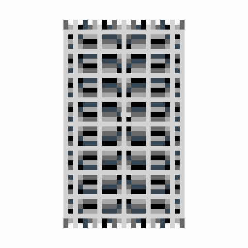

# Solana Starter

A comprehensive Solana development starter kit with implementations for various blockchain operations across different programming languages and frameworks.

## Project Structure

This repository contains multiple implementation directories:

- **ts/** - TypeScript implementation with comprehensive Solana examples
- **rs/** - Rust implementation (TODO)
- Additional language implementations may be added

## NFT Collection

### Generug NFT



## Getting Started

### TypeScript Implementation

1. Navigate to the TypeScript directory:
   ```bash
   cd ts
   ```

2. Install dependencies:
   ```bash
   npm install
   ```

3. Set up your wallet configuration

4. Run the desired scripts using npm run commands

### Available Scripts

Each implementation directory contains its own set of available scripts. Please refer to the package.json or documentation within each language-specific directory for detailed script information.

## Dependencies

### TypeScript
- @solana/web3.js
- @solana/spl-token
- @coral-xyz/anchor
- @metaplex-foundation packages
- TypeScript

## Progress

| File | Status |
|------|--------|
| ts/cluster1/spl_init.ts | ✅ |
| ts/cluster1/spl_mint.ts | ✅ |
| ts/cluster1/spl_transfer.ts | ❌ |
| ts/cluster1/spl_metadata.ts | ❌ |
| ts/cluster1/nft_image.ts | ✅ |
| ts/cluster1/nft_metadata.ts | ✅ |
| ts/cluster1/nft_mint.ts | ✅ |
| ts/cluster1/vault_init.ts | ❌ |
| ts/cluster1/vault_deposit.ts | ❌ |
| ts/cluster1/vault_withdraw.ts | ❌ |
| ts/cluster1/vault_deposit_spl.ts | ❌ |
| ts/cluster1/vault_withdraw_spl.ts | ❌ |
| ts/cluster1/vault_deposit_nft.ts | ❌ |
| ts/cluster1/vault_withdraw_nft.ts | ❌ |
| ts/cluster1/vault_close.ts | ❌ |
